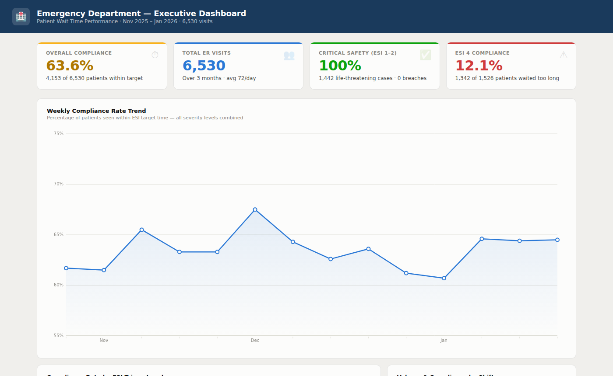
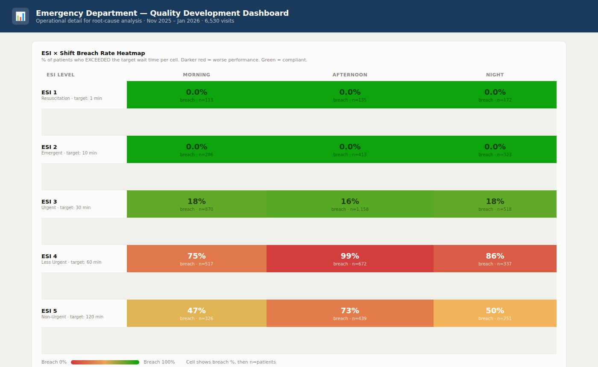

# Emergency Department Wait Time Dashboard

> **3-month snapshot · Nov 2025 – Jan 2026 · 6,530 visits**
>
> - Overall compliance: **63.6%** — more than 1 in 3 patients waits longer than their triage target
> - ESI 1 & 2 (life-threatening): **100% compliant** — the critical safety pathway is intact
> - ESI 4 (Less Urgent, 60-min target): **12.1% compliant** — 88 in 100 patients exceed the target
> - ESI 4 × Afternoon shift: **98.8% breach rate** — effectively every patient misses target
> - Trend: **flat for 14 consecutive weeks** — no self-correction; structural change needed

---

## Preview

### Executive Dashboard

### Quality Development Dashboard

*Both dashboards are interactive — open the live versions linked above.*

---

## Quick Start

Open `ED_Executive_Dashboard.html` or `ED_QualityDev_Dashboard.html` in any browser — no install needed.

To reproduce every statistic: `pip install pandas && python analysis.py`

---

## Dataset

| Field | Description |
|---|---|
| `Patient_ID` | De-identified unique patient identifier *(from dataset)* |
| `Visit_Date` | Date of ED visit (DD/MM/YYYY) *(from dataset)* |
| `Shift` | Operational shift: Morning / Afternoon / Night *(from dataset)* |
| `Emergency Severity Index (ESI)` | Triage level assigned at arrival (1 = most severe, 5 = least severe) *(from dataset)* |
| `Waiting_Time_Minutes` | Minutes from arrival to first clinician contact *(from dataset)* |
| `within_target` | TRUE if wait ≤ ESI target, FALSE otherwise *(derived — created by author)* |
| `target` | Target wait time in minutes for the assigned ESI level *(derived — created by author)* |

**6,530 visits · no missing values**

### ESI Triage Levels and Targets

| Level | Category | Target | Clinical Description |
|---|---|---|---|
| ESI 1 | Resuscitation | ≤ 1 min | Immediate life-threatening intervention (e.g., cardiac arrest, major trauma) |
| ESI 2 | Emergent | ≤ 10 min | High-risk, severe pain or distress (e.g., stroke, chest pain) |
| ESI 3 | Urgent | ≤ 30 min | Stable vitals, requires multiple resources (labs, imaging) |
| ESI 4 | Less Urgent | ≤ 60 min | Stable, one simple resource needed (e.g., suture) |
| ESI 5 | Non-Urgent | ≤ 120 min | Stable, no diagnostic resources needed (e.g., prescription refill) |

---

## Descriptive Statistics

### Overall

| Metric | Value |
|---|---|
| Total visits | 6,530 |
| Within target | 4,153 (63.6%) |
| Exceeding target | 2,377 (36.4%) |
| Mean wait (all patients) | 55.5 min |
| Mean target (all patients) | 46.0 min |
| Observation period | **89 days** (Nov 1, 2025 – Jan 28, 2026) |
| Mean daily visits | ~73/day (84 of 89 days with recorded visits) |

### Compliance by ESI Level

| ESI | Category | n | Within Target | Compliance | Avg Wait | Median Wait | Target |
|---|---|---|---|---|---|---|---|
| 1 | Resuscitation | 420 | 420 | **100.0%** | 0.5 min | 0 min | 1 min |
| 2 | Emergent | 1,022 | 1,022 | **100.0%** | 2.0 min | 2 min | 10 min |
| 3 | Urgent | 2,546 | 2,107 | **82.8%** | 31.1 min | 15 min | 30 min |
| 4 | Less Urgent | 1,526 | 184 | **12.1%** | 95.4 min | 89 min | 60 min |
| 5 | Non-Urgent | 1,016 | 420 | **41.3%** | 133.2 min | 128 min | 120 min |

> ESI 1 & 2 (n = 1,442) are 100% compliant — the critical safety pathway is intact. ESI 4 is the most severely underperforming group, with 88% of patients waiting beyond the 60-minute target. When ESI 3 patients do breach, median excess wait is ~99 minutes above the 30-minute threshold.

### Compliance by Shift

| Shift | n | Within Target | Compliance |
|---|---|---|---|
| Morning | 2,112 | 1,413 | 66.9% |
| Afternoon | 2,817 | 1,649 | 58.5% |
| Night | 1,601 | 1,091 | 68.1% |

> Afternoon handles 43% of all visits with the lowest compliance — the highest-volume, worst-performing shift.

### Breach Rate: ESI × Shift

| | Morning | Afternoon | Night |
|---|---|---|---|
| ESI 1 | 0% | 0% | 0% |
| ESI 2 | 0% | 0% | 0% |
| ESI 3 | 18.3% | 16.0% | 18.3% |
| ESI 4 | 75.0% | **98.8%** | 86.1% |
| ESI 5 | 46.6% | 72.7% | 49.8% |

### Compliance by Day of Week

| Mon | Tue | Wed | Thu | Fri | Sat | Sun |
|---|---|---|---|---|---|---|
| 65.9% | 62.9% | 64.7% | 62.9% | 65.6% | 61.8% | 61.7% |

> Weekends show slightly lower compliance — weekend staffing may warrant review.

### Trend Over Time

Weekly compliance ranged from 60.7% to 67.5% across 14 weeks with no sustained improvement. The flat trend rules out seasonal or random variation and points to a structural cause.

---

## Files

| File | Description |
|---|---|
| `ed_visits.csv` | Source data — de-identified, 6,530 rows |
| `analysis.py` | Python script (requires pandas) that recomputes every statistic from the CSV |
| `ED_Executive_Dashboard.html` | Standalone executive dashboard — open in any browser |
| `ED_QualityDev_Dashboard.html` | Standalone quality-development dashboard — open in any browser |
| `ED_Executive_Dashboard.pdf` | Single-page PDF export of the executive dashboard |
| `ED_QualityDev_Dashboard.pdf` | Single-page PDF export of the QD dashboard |
| `index.html` | GitHub Pages landing page for this project folder |
| `exec-preview.png` | Static preview of the executive dashboard |
| `qd-preview.png` | Static preview of the QD dashboard |

---

## Technical Notes

- All charts use vanilla HTML5 Canvas — no external libraries, fully self-contained, works offline.
- PDFs were generated with Playwright + Chromium at a 1400 px viewport; content height is measured at runtime so each dashboard fits on a single page with no clipping.
- `within_target` and `target` are not in the original source data. They are derived by the author in `analysis.py` by comparing `Waiting_Time_Minutes` against ESI-specific thresholds.
- ESI 1 and 2 are excluded from box plots and monthly trend charts because 100% compliance collapses the y-axis scale and hides variation in ESI 3–5.

---

*Last updated: September 2026*
